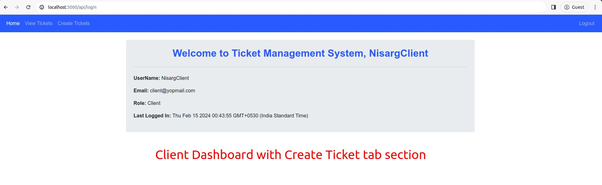
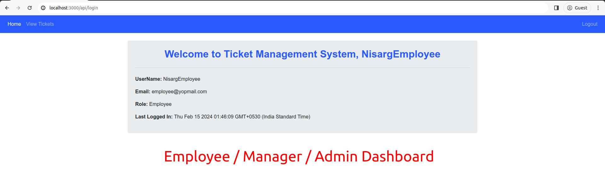
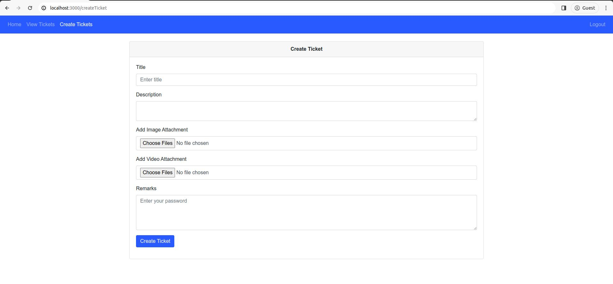
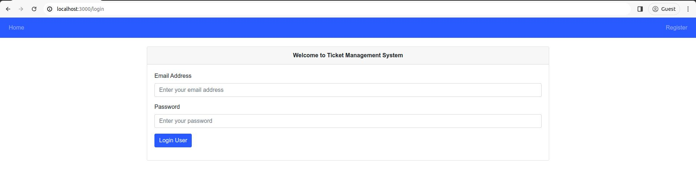
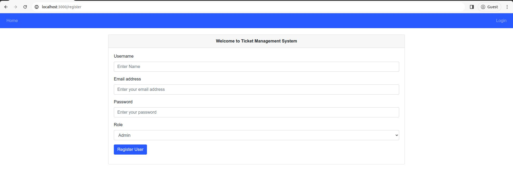
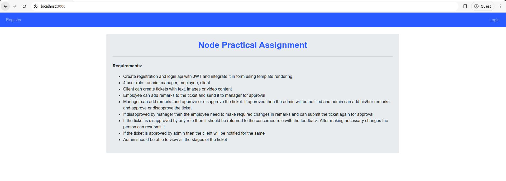

# Node Practical ToDo List

# Requirements:
- [ ] Create registration and login api with JWT and integrate it in form using template rendering
- [ ] 4 user role - admin, manager, employee, client
- [ ] Client can create tickets with text, images or video content.
- [ ] Employee can add remarks to the ticket and send it to manager for approval
- [ ] Manager can add remarks and approve or disapprove the ticket. If approved then the admin will be notified and admin can add his/her remarks and approve or disapprove the ticket.
- [ ] If disapproved by manager then the employee need to make required changes in remarks and can submit the ticket again for approval.
- [ ] If the ticket is disapproved by any role then it should be returned to the concerned role with the feedback. After making necessary changes the person can resubmit it.
- [ ] If the ticket is approved by admin then the client will be notified for the same.
- [ ] Admin should be able to view all the stages of the ticket.

# Snapshots:

